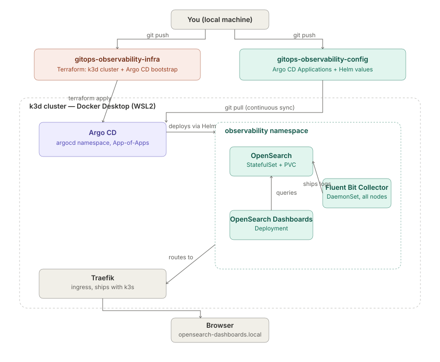

# gitops-observability-infra

Terraform for the local GitOps Observability Lab: provisions a multi-node
k3d cluster and installs Argo CD. This repo owns **cluster and cluster-addon
lifecycle only** — no Kubernetes application manifests live here. Once
Argo CD is up, everything else is reconciled from the separate
`gitops-observability-config` repo.

## Architecture



This repo owns the **left-hand path**: `git push` → `terraform apply` →
provisioned k3d cluster with Argo CD installed. Everything to the right of
that (Argo CD watching `gitops-observability-config`, the OpenSearch/Fluent
Bit/Dashboards stack, Traefik routing) is reconciled continuously by Argo
CD, not by this repo — once `terraform apply` finishes here, this repo's
job for that cluster session is done.

## Why two Terraform stages, not one

There's no mature Terraform provider for k3d, so cluster creation goes
through `local-exec` + the k3d CLI (see `01-cluster`). If cluster creation
and Argo CD installation (via the `kubernetes`/`helm` providers) were in the
same `terraform apply`, those providers would get configured before the
cluster — and its kubeconfig — exist. Splitting into two independently
state-tracked stages avoids that, and is also just operationally cleaner:
you can `terraform destroy` Argo CD without tearing down the cluster.

## Prerequisites

- Docker Desktop running (with enough resources allocated — see
  `RUNBOOK.md` for specifics)
- `k3d`, `kubectl`, `terraform`, `helm`, `argocd` CLI on PATH
- PowerShell (this repo's `local-exec` provisioners are written for it)

## Quick start

```powershell
./scripts/bootstrap.ps1
```

Or run each stage manually — see `RUNBOOK.md` for the full walkthrough with
verification steps after each command.

## Layout

```
terraform/
├── 01-cluster/            k3d cluster (null_resource + k3d CLI)
└── 02-argocd-bootstrap/   Argo CD via Helm, against 01-cluster's kubeconfig
scripts/
└── bootstrap.ps1          runs both stages in order
```
